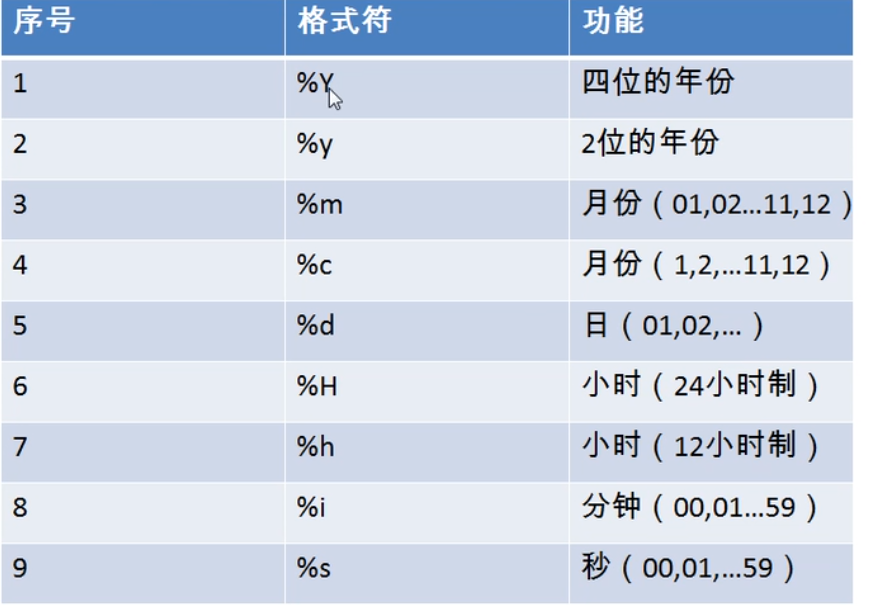

# DQL (Database Query Language) 数据库查询语言

## 基础查询

- 一、语法

```mysql
selet[select 选项] 
    字段列表[字段别名]  
from 数据源
```

- 二、 特点

1. 查询列表可以是字段，常量，表达式，函数，也可以是多个
2. 查询结果是一个虚拟表

- 三、示例

```mysql
select 字段名 from 表名;
select * from tablename;
select 常量值;
select functionName(..);
select 100/1234;#表达式
# 起别名 
① as
② 空格
# 去重
selecdt distinct 字段名 from tablename;
# +
做加法运算
select 数值+数值; 直接运算
select 字符+数值; 先试图将字符转换成数值，再相加。转换失败转为 0 +数值
select null+数值; 永远为null
# 【补充】concat函数
功能：拼接字符
select concat('','',...);
#  【补充】ifNull
功能: 判断字符是否为空，并设置默认值
# 【补充】 isNull
功能： 判断字符是否为null 返回 1 true，0 false。
```

---

## 条件查询

- 语法

```mysql
selet[select 选项] 
    字段列表[字段别名]  
from 数据源
[where条件字句]
```

- 筛选条件的分类

  - 简单条件运算符

    ```c
    > < = <> != >= <= <=>安全等于
    ```

  - 逻辑运算符

    ```mysql
    && and 
    || or 
    !  not 
    ```

  - 模糊查询

    ```mysql
    like : 一般搭配通配符使用，用于判断数值
    	% ： 任意字符 0~
    	_ :  任意单个字符

    between   and  
    in
    is null /is not null : 用于判断null值
    ```

  - 排序查询 `order by`

    ```mysql
    selet[select 选项] 
        字段列表[字段别名]  
    from 数据源
    [where 筛选条件]
    [order by 排序列表 [asc|desc]]
    ```

    **order by 子句一般放在查询语句的最后面，除 `limit`之外**

---


## 常见函数

> 概念：类似于java的方法，将一组逻辑语句封装在方法中，对外暴露方法名
>
> 好处：1、隐藏了实现细节 2、提高代码的重用性
>
> 特点：①叫什么（函数名）
>
> ​	    ②干什么（函数功能）
>
> 分类：
>
>  1.  单行函数
>
>      > 如 concat 、length、ifnull等
>
>  2.  分组函数
>
>      > 功能： 做统计使用，又称为统计函数，聚合函数，组函数

### 单行函数

- 字符函数

  - `length`	:字符长度
  - `concat `   : 拼接字符
  - `upper `     : 转大写
  - `lower `      : 转小写
  - `substr(str,pos,len)` : 截取从指定索引处指定长度的字符串
  - `instr(str,substr)` : 返回substr在str中第一次出现的索引，否则为返回0
  - `trim('a' from string)` : 去处左右两边 a的字符，from之前指定特定字符
  - `lpad('hhh',10,'*')`:用指定的字符实现做填充指定长度
  - `replace(str,oldstr,newstr)` : 使用newstr 替换oldstr 。 

- 数学函数

  - `round(n)`:四舍五入 `round(n,d)`:保留d为小数，四舍五入

  - `cell` 向上取整

  - `floor` 向下取整

  - `truncate(n,d)` 截断  截断n后面d位小数 

    > SELECT TRUNCATE(1.3333434,2);
    >
    > = 1.33

  - `mod` 取余 = a-a/b*b

    > SELECT MOD(5,3);
    >
    > = 2

- 日期函数

  - now() 返回当前系统日期+时间

  - curdate 返回当前系统日期，不包含时间

  - curtime 返回当前时间，不包含日期

  - year 返回年

  - month返回月

  - monthname 月名

  - str_to_date:将日期格式的字符转换成指定格式

    > str_to_date('9-13-1999','%m-%d-%Y')
    > 1999-09-13
    >
    > 

  - `data_format` 将日期转换成字符

    > date_format('2018/5/5','%Y年%m月%d日')
    > 2018年05月05日

  ​

- 其他函数

  ```mysql
  #其他函数
  SELECT VERSION();
  SELECT DATABASE();
  SELECT USER();
  ```

- 流程控制函数\

  - 1.if函数

  ```mysql
  SELECT IF(10>3,'a','b');
  ```

  - case 结构 两种情况

    > 1. switch case 的效果

    ```mysql
    # 2. case
    	# 
    /*
    mysql 中
    case 要判断的字段或表达式
    when 常量1 then 值或表达式
    ..
    else 表达式
    end
    */	
    SELECT student_id,course_id,
      CASE course_id
      WHEN 1 THEN number * 100
      WHEN 2 THEN number * 200
      ELSE number*10
      END AS 成绩
    FROM score;
    ```

    > 2.  类似于多重if

    ```mysql
    # case 使用 2 
    # 类似于多重if
    /*
    case 
    when 条件1 then 要显示的值1或语句1
    ...
    else 要显示的n或语句n
    end
    */
    SELECT student_id , course_id,number,
    	CASE
    	WHEN number > 90 THEN 'A'
    	WHEN number > 80 THEN 'B'
    	WHEN number > 60 THEN 'C'
    	ELSE 'D'
    	END AS 评级
    FROM score;
    ```

---


### 组函数

- ​